The website will have the following specification:

* Show a list of bookmarks
* Add new bookmarks
* Delete bookmarks
* Update bookmarks
* Comment on bookmarks
* Tag bookmarks into categories
* Filter bookmarks by tag
* Users are restricted to manage only their own bookmarks

## First user story and rough domain model

```
As a user,
So that I know what bookmarks I have
I would like to see a list of bookmarks
```

bookmark

- name
- url

bookmark_list

- array of bookmarks
- display_bookmarks



## Second user story

```
As a time-pressed user
So that I can save a website
I would like to add the site's address and title to bookmark manager
```

## DB Instructions

1. Connect to psql
2. Create a database with `CREATE DATABASE "bookmark_manager";`
3. Connect to the database with \c bookmark_manager;
4. Run the query stored in migrations/01_create_bookmarks_table.sql